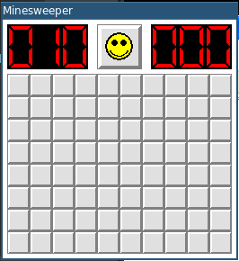
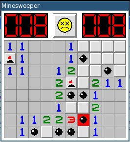
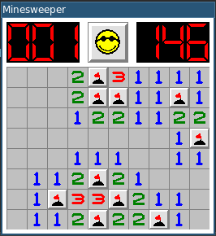

# Minesweeper

Mimics the Windows XP Minesweeper.

Left click to uncover a square. 

Right click to mark it as mine.

Once you have marked all mines around a numbered square, 
you can uncover remaining squares around it by left clicking the numbered square.

